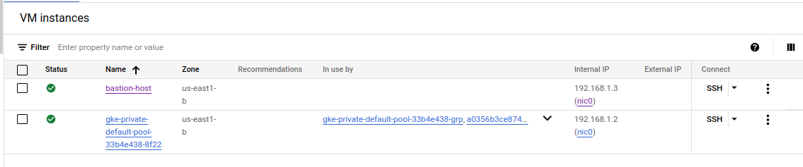

# deploy Jenkins pipeline with private GKE , terraform, ansible , prometheus ,Slack
This repository contains code and instructions for setting up a Jenkins pipeline that deploys a sample application to a Google Kubernetes Engine (GKE) cluster using Ansible (over google IAP servers) and terraform

# Prerequisites
 To use this pipeline, you'll need:
  - Google Cloud Platform (GCP) account with the necessary permissions
  - Google Cloud SDK
  - GKE cluster
  - Ansible installed 
  - terraform installed
  - slack channel

# Getting started
1. Clone this repository to your local machine. 

    ``` git clone https://github.com/ahmedsaadx/jenkins-pipeline-with-gke-and-ansible.git```

2. start with terraform
   ``` 
   cd terraform
   terraform init
   terraform apply --auto-approve  
   ```

3. start playing with ansible (you need add kubconfig path , slack token  )
   ```
   cd ..
   ansible -i hosts playbook.yaml
   ```
4. jenkins pipeline configurations
   1. access jenkins LB with browser (open loadbalancer page in google account and grep lb ip )
   2. exec the Container and get the First Password
   3. install plugins and create account
   4. add github and dockerhub cred
   5. create pipeline with jenkins file from this repo https://github.com/ahmedsaadx/goapp
   6. build now 

# results
### private instances (private bastion host and gke node)



 
    

